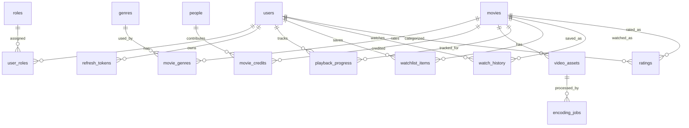

# Entity Relationship Design

Status: Frozen for MVP implementation

## Scope

This ERD is the MVP schema baseline. It supports auth, RBAC, movie metadata, upload, encoding, playback, search, watchlist, history, progress, and rating.

Out of scope for this ERD:

- comments
- payments
- recommendations
- multi-quality HLS variants
- subtitles
- analytics dashboards

## Naming And Types

- Table and column names use `snake_case`.
- Primary keys use `uuid` unless noted otherwise.
- Timestamps use `timestamptz`.
- Schema changes are managed through Flyway only.
- Existing committed migrations must not be edited.
- API responses use DTOs, not JPA entities.

## Status Values

Status values must match the domain glossary.

| Entity | Column | Values |
|---|---|---|
| `users` | `status` | `ACTIVE`, `DISABLED` |
| `movies` | `status` | `DRAFT`, `PUBLISHED`, `ARCHIVED` |
| `video_assets` | `status` | `UPLOADED`, `QUEUED`, `PROCESSING`, `READY`, `FAILED` |
| `encoding_jobs` | `status` | `QUEUED`, `PROCESSING`, `READY`, `FAILED` |

`encoding_jobs.status = READY` means the job completed successfully and the linked video asset is ready for playback.

## Logical ERD

## Tables

### `users`

| Column | Type | Constraints | Notes |
|---|---|---|---|
| `id` | uuid | PK | User ID |
| `email` | varchar(320) | unique, not null | Login identifier |
| `password_hash` | varchar(255) | not null | BCrypt hash |
| `display_name` | varchar(100) | not null | Public display name |
| `status` | varchar(20) | not null, check | `ACTIVE`, `DISABLED` |
| `created_at` | timestamptz | not null | Creation timestamp |
| `updated_at` | timestamptz | not null | Last update timestamp |

Indexes:

- unique `ux_users_email` on `email`
- `ix_users_status` on `status`

### `roles`

| Column | Type | Constraints | Notes |
|---|---|---|---|
| `id` | smallserial | PK | Role ID |
| `name` | varchar(50) | unique, not null | `ROLE_USER`, `ROLE_ADMIN` |

Indexes:

- unique `ux_roles_name` on `name`

### `user_roles`

| Column | Type | Constraints | Notes |
|---|---|---|---|
| `user_id` | uuid | PK, FK -> `users.id` on delete cascade | User |
| `role_id` | smallint | PK, FK -> `roles.id` restrict delete | Role |

Constraints:

- primary key: (`user_id`, `role_id`)

### `refresh_tokens`

| Column | Type | Constraints | Notes |
|---|---|---|---|
| `id` | uuid | PK | Token record ID |
| `user_id` | uuid | FK -> `users.id` on delete cascade, not null | Owner |
| `token_hash` | varchar(255) | unique, not null | Hash only |
| `expires_at` | timestamptz | not null | Expiration |
| `revoked_at` | timestamptz | null | Revocation timestamp |
| `created_at` | timestamptz | not null | Creation timestamp |

Indexes:

- unique `ux_refresh_tokens_token_hash` on `token_hash`
- `ix_refresh_tokens_user_id` on `user_id`
- `ix_refresh_tokens_expires_at` on `expires_at`

### `movies`

| Column | Type | Constraints | Notes |
|---|---|---|---|
| `id` | uuid | PK | Movie ID |
| `title` | varchar(255) | not null | Movie title |
| `slug` | varchar(255) | unique, not null | URL-safe identifier |
| `description` | text | not null | Catalog description |
| `release_year` | int | null | Release year |
| `maturity_rating` | varchar(20) | null | Optional content rating |
| `poster_object_key` | varchar(512) | null | Deferred thumbnail/poster object key |
| `status` | varchar(20) | not null, check | `DRAFT`, `PUBLISHED`, `ARCHIVED` |
| `search_vector` | tsvector | null | PostgreSQL FTS vector |
| `created_at` | timestamptz | not null | Creation timestamp |
| `updated_at` | timestamptz | not null | Last update timestamp |

Indexes:

- unique `ux_movies_slug` on `slug`
- GIN `ix_movies_search_vector` on `search_vector`
- `ix_movies_status` on `status`
- `ix_movies_release_year` on `release_year`

### `genres`

| Column | Type | Constraints | Notes |
|---|---|---|---|
| `id` | uuid | PK | Genre ID |
| `name` | varchar(100) | unique, not null | Genre name |
| `slug` | varchar(120) | unique, not null | URL-safe identifier |

Indexes:

- unique `ux_genres_name` on `name`
- unique `ux_genres_slug` on `slug`

### `movie_genres`

| Column | Type | Constraints | Notes |
|---|---|---|---|
| `movie_id` | uuid | PK, FK -> `movies.id` on delete cascade | Movie |
| `genre_id` | uuid | PK, FK -> `genres.id` restrict delete | Genre |

Constraints:

- primary key: (`movie_id`, `genre_id`)

### `people`

| Column | Type | Constraints | Notes |
|---|---|---|---|
| `id` | uuid | PK | Person ID |
| `name` | varchar(255) | not null | Actor or director name |
| `slug` | varchar(255) | unique, not null | URL-safe identifier |

Indexes:

- unique `ux_people_slug` on `slug`
- `ix_people_name` on `name`

### `movie_credits`

| Column | Type | Constraints | Notes |
|---|---|---|---|
| `movie_id` | uuid | PK, FK -> `movies.id` on delete cascade | Movie |
| `person_id` | uuid | PK, FK -> `people.id` restrict delete | Person |
| `credit_role` | varchar(20) | PK, check | `ACTOR`, `DIRECTOR` |
| `sort_order` | int | null | Display order |

Indexes:

- `ix_movie_credits_person_id` on `person_id`
- `ix_movie_credits_role` on `credit_role`

### `video_assets`

| Column | Type | Constraints | Notes |
|---|---|---|---|
| `id` | uuid | PK | Video asset ID |
| `movie_id` | uuid | FK -> `movies.id` on delete cascade, not null | Owning movie |
| `raw_bucket` | varchar(100) | not null | MinIO raw bucket |
| `raw_object_key` | varchar(512) | not null | Raw video object key |
| `hls_bucket` | varchar(100) | null | MinIO HLS bucket |
| `hls_master_object_key` | varchar(512) | null | Master playlist object key |
| `status` | varchar(20) | not null, check | `UPLOADED`, `QUEUED`, `PROCESSING`, `READY`, `FAILED` |
| `duration_seconds` | int | null | FFprobe duration |
| `width` | int | null | Source or output width |
| `height` | int | null | Source or output height |
| `codec` | varchar(100) | null | Primary video codec |
| `bitrate` | int | null | Bitrate if available |
| `failure_reason` | text | null | Safe diagnostic summary |
| `created_at` | timestamptz | not null | Creation timestamp |
| `updated_at` | timestamptz | not null | Last update timestamp |

Indexes:

- `ix_video_assets_movie_id` on `movie_id`
- `ix_video_assets_status` on `status`
- unique `ux_video_assets_raw_object` on (`raw_bucket`, `raw_object_key`)
- unique `ux_video_assets_hls_master` on (`hls_bucket`, `hls_master_object_key`) where `hls_master_object_key` is not null

### `encoding_jobs`

| Column | Type | Constraints | Notes |
|---|---|---|---|
| `id` | uuid | PK | Job ID |
| `video_asset_id` | uuid | FK -> `video_assets.id` on delete cascade, not null | Target asset |
| `status` | varchar(20) | not null, check | `QUEUED`, `PROCESSING`, `READY`, `FAILED` |
| `attempt` | int | not null, check `attempt >= 1` | Starts at 1 |
| `error_message` | text | null | Safe diagnostic summary |
| `queued_at` | timestamptz | not null | Queue timestamp |
| `started_at` | timestamptz | null | Worker start timestamp |
| `finished_at` | timestamptz | null | Completion timestamp |

Indexes:

- `ix_encoding_jobs_video_asset_id` on `video_asset_id`
- `ix_encoding_jobs_status` on `status`
- unique `ux_encoding_jobs_asset_attempt` on (`video_asset_id`, `attempt`)

### `playback_progress`

| Column | Type | Constraints | Notes |
|---|---|---|---|
| `user_id` | uuid | PK, FK -> `users.id` on delete cascade | User |
| `movie_id` | uuid | PK, FK -> `movies.id` on delete cascade | Movie |
| `current_seconds` | int | not null, check `current_seconds >= 0` | Last saved position |
| `duration_seconds` | int | null, check `duration_seconds >= 0` | Known duration |
| `finished` | boolean | not null default false | Completion flag |
| `last_played_at` | timestamptz | not null | Last progress timestamp |
| `created_at` | timestamptz | not null | Creation timestamp |
| `updated_at` | timestamptz | not null | Last update timestamp |

Indexes:

- `ix_playback_progress_user_last_played` on (`user_id`, `last_played_at`)

### `watchlist_items`

| Column | Type | Constraints | Notes |
|---|---|---|---|
| `id` | uuid | PK | Watchlist item ID |
| `user_id` | uuid | FK -> `users.id` on delete cascade, not null | Owner |
| `movie_id` | uuid | FK -> `movies.id` on delete cascade, not null | Saved movie |
| `created_at` | timestamptz | not null | Creation timestamp |

Constraints and indexes:

- unique `ux_watchlist_items_user_movie` on (`user_id`, `movie_id`)
- `ix_watchlist_items_user_created` on (`user_id`, `created_at`)

### `watch_history`

| Column | Type | Constraints | Notes |
|---|---|---|---|
| `id` | uuid | PK | History item ID |
| `user_id` | uuid | FK -> `users.id` on delete cascade, not null | Owner |
| `movie_id` | uuid | FK -> `movies.id` on delete cascade, not null | Watched movie |
| `started_at` | timestamptz | not null | First watch timestamp |
| `last_watched_at` | timestamptz | not null | Last watch timestamp |
| `completed_at` | timestamptz | null | Completion timestamp |

Indexes:

- `ix_watch_history_user_last_watched` on (`user_id`, `last_watched_at`)
- unique `ux_watch_history_user_movie` on (`user_id`, `movie_id`)

### `ratings`

| Column | Type | Constraints | Notes |
|---|---|---|---|
| `id` | uuid | PK | Rating ID |
| `user_id` | uuid | FK -> `users.id` on delete cascade, not null | Owner |
| `movie_id` | uuid | FK -> `movies.id` on delete cascade, not null | Rated movie |
| `rating` | int | not null, check `rating >= 1 AND rating <= 5` | User rating |
| `created_at` | timestamptz | not null | Creation timestamp |
| `updated_at` | timestamptz | not null | Last update timestamp |

Constraints and indexes:

- unique `ux_ratings_user_movie` on (`user_id`, `movie_id`)
- `ix_ratings_movie_id` on `movie_id`

## Search Design

MVP uses PostgreSQL full-text search. The `movies.search_vector` column includes normalized text from:

- movie title
- description
- genre names
- actor names
- director names

The `search_vector` is rebuilt by application code on any metadata change that affects searchable fields. Database triggers are deferred to avoid hidden logic during the first implementation pass.

## Deletion Rules

- Movie delete in API means archive: set `movies.status = 'ARCHIVED'`.
- Hard delete is not part of MVP user/admin flow.
- User-owned records are scoped by authenticated user ID.
- Deleting a `users` row cascades to refresh tokens, playback progress, watchlist items, watch history, and ratings.
- Media object cleanup is not automatic on movie archive.
