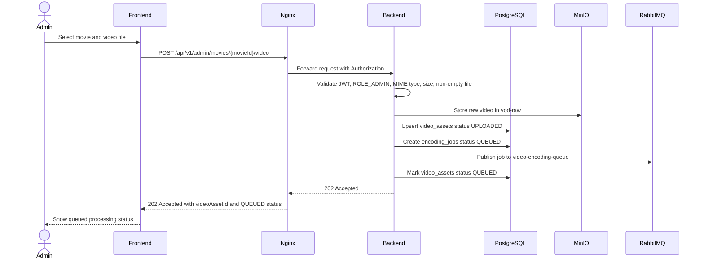
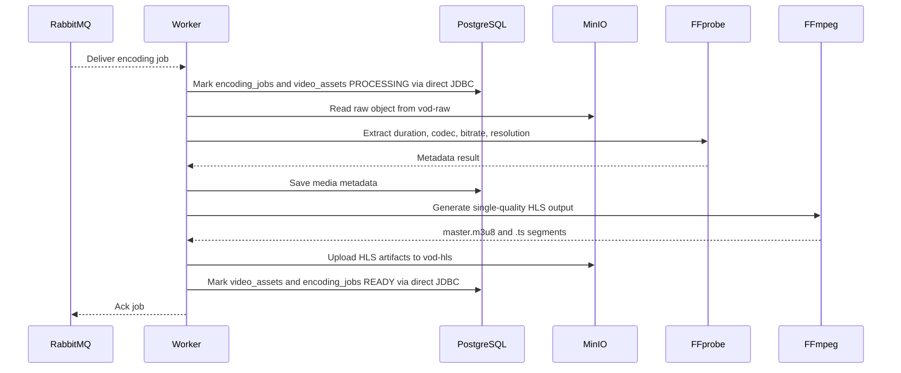
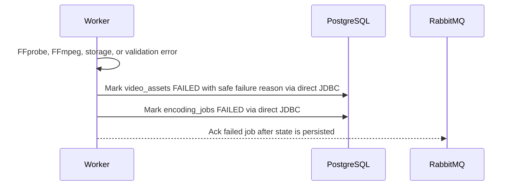
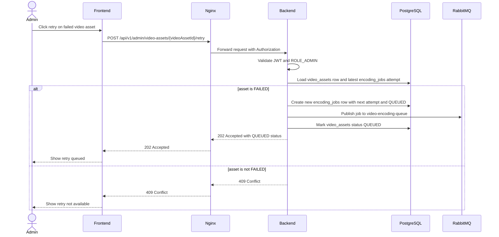
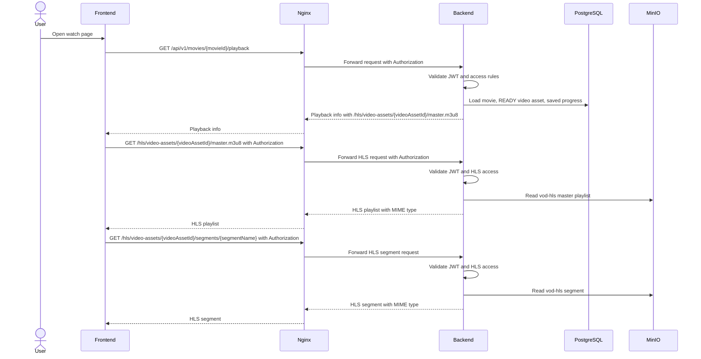
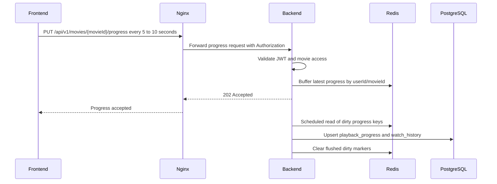
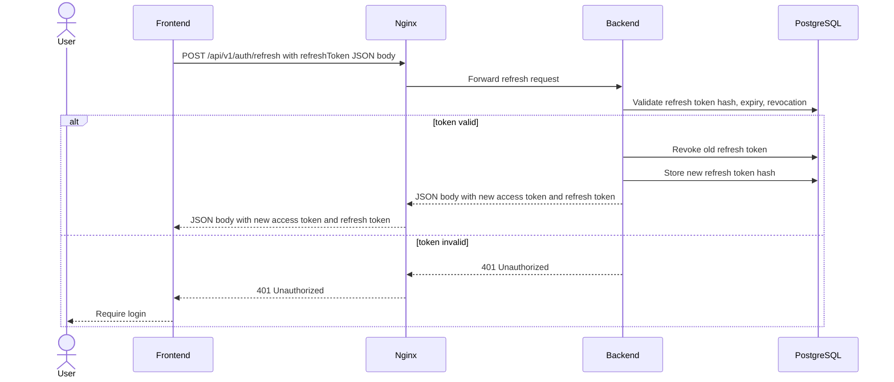
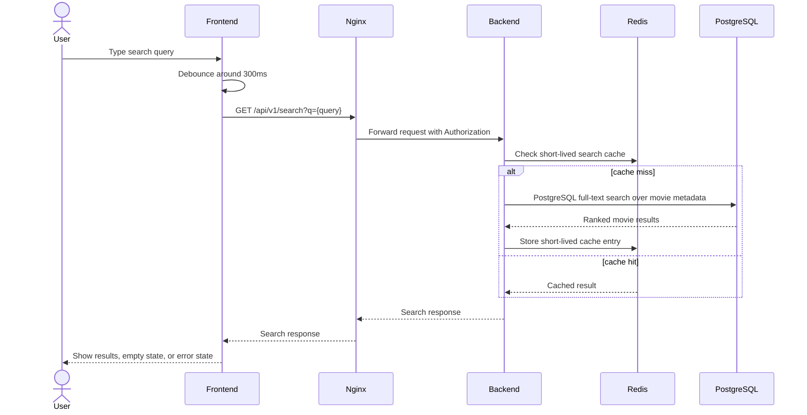

# Sequence Diagrams

Status: Frozen for MVP implementation

These diagrams define the frozen MVP runtime flows. They are architecture contracts, not implementation code.

## Admin Upload

## Worker Encoding

Failure path:

## Admin Retry Failed Encoding

## Playback

## Playback Progress

## Auth Refresh

## Search

